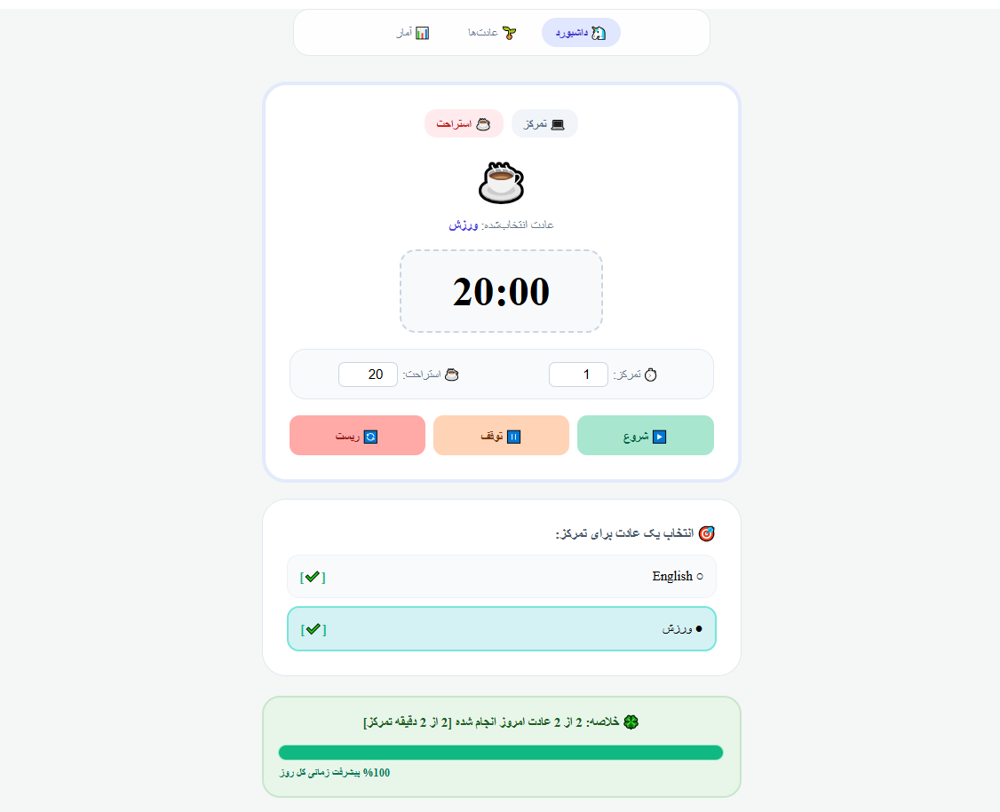
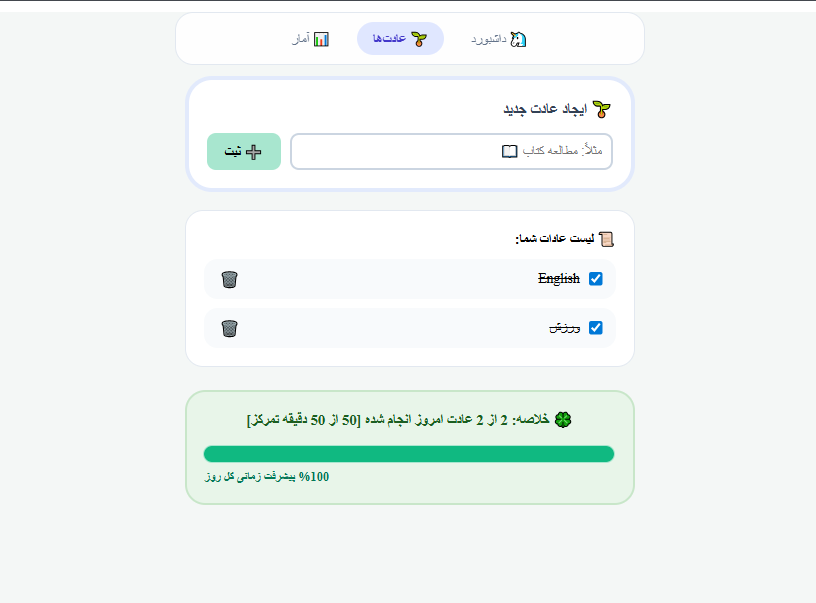
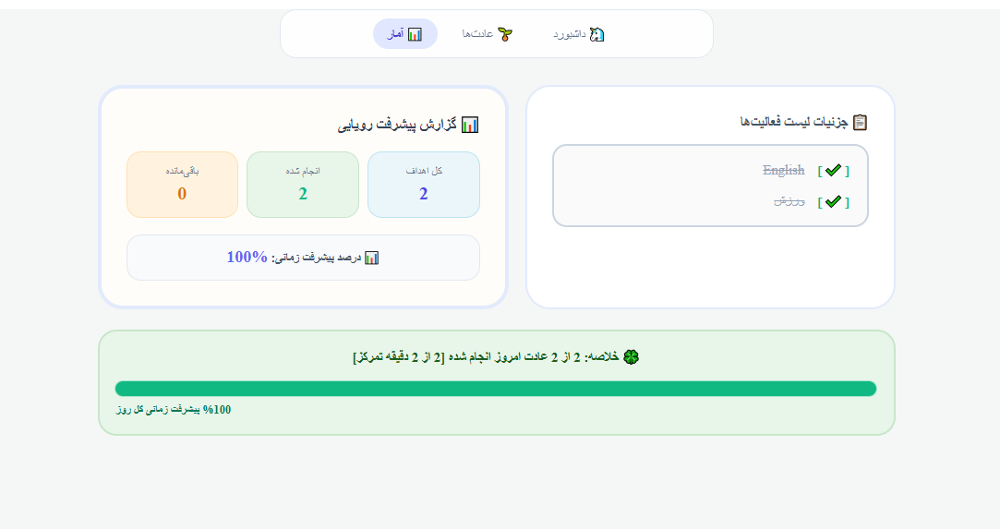
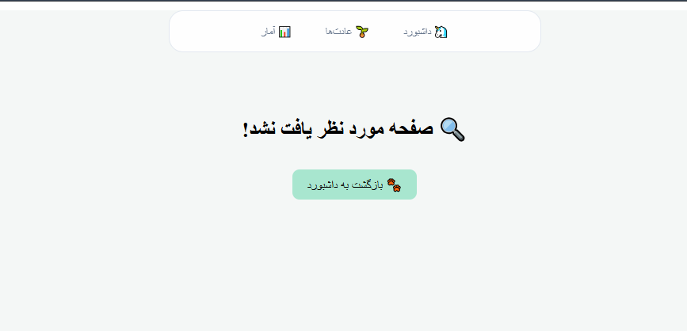
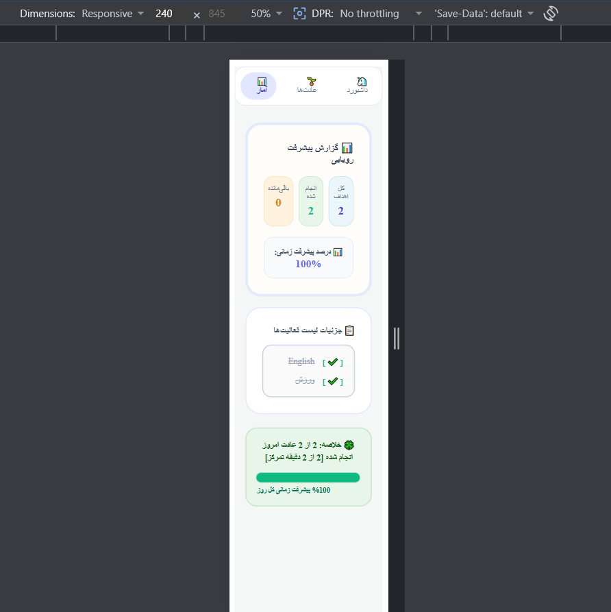

(it has tiny problems but im so over it 😫)


# 📘 پروژه React - Habit Tracker & Focus Timer

## 🎯 معرفی پروژه

در این تمرین باید یک اپلیکیشن مدیریت عملکرد شخصی با React پیاده‌سازی کنید. کاربر می‌تواند عادت‌های روزانه خود را ثبت، مدیریت و پیگیری کند. همچنین یک **تایمر تمرکز (Focus Timer)** مشابه تکنیک Pomodoro برای انجام فعالیت‌ها در نظر گرفته شده است.

هدف اصلی تمرین، تسلط بر مفاهیم زیر است:

- `useState`
- `useEffect`
- `React Router`
- Custom Hooks
- Local Storage
- Responsive Design

---

# ✨ قابلیت‌های اصلی پروژه

## مدیریت عادت‌ها (Habit Management)
 
کاربر باید بتواند:

- عادت جدید ثبت کند
- عادت را انجام‌شده/انجام‌نشده علامت‌گذاری کند
- عادت را حذف کند
- وضعیت پیشرفت خود را مشاهده کند

ساختار هر عادت:

```javascript
{
  id: Date.now(),
  title: "ورزش",
  completed: false
}
```
## ⏱️ تایمر تمرکز (Focus Timer)

کاربر:

1. یک عادت انتخاب می‌کند.
2. تایمر را شروع می‌کند.
3. شمارش معکوس آغاز می‌شود.
4. در پایان زمان، پیام موفقیت نمایش داده می‌شود.

### نمونه پیام

```text
جلسه تمرکز برای «مطالعه کتاب» تمام شد!
```

---

## 📊 گزارش آماری (Analytics)

نمایش اطلاعات زیر:

- تعداد کل عادت‌ها
- تعداد انجام‌شده
- تعداد باقی‌مانده
- درصد پیشرفت
- نوار پیشرفت (Progress Bar)

---

# 🗂 صفحات پروژه

## 🏠 صفحه داشبورد (`/`)

شامل:

### ⏱️ تایمر تمرکز

نمایش:

- عادت انتخاب‌شده
- زمان باقی‌مانده
- دکمه شروع
- دکمه توقف
- دکمه ریست

### 📋 لیست انتخاب عادت

کاربر می‌تواند یکی از عادت‌ها را برای تایمر انتخاب کند.

### 📈 خلاصه وضعیت

نمونه:

```text
۱ از ۳ عادت امروز انجام شده است.
```

---

## 📝 صفحه مدیریت عادت‌ها (`/habits`)

شامل:

### ➕ فرم افزودن عادت

ویژگی‌ها:

- Controlled Component
- استفاده از `useState`
- جلوگیری از ثبت مقدار خالی

### 📋 لیست عادت‌ها

هر آیتم شامل:

- Checkbox یا Toggle
- عنوان عادت
- دکمه حذف

اگر عادت انجام شده باشد:

```css
text-decoration: line-through;
```

اگر لیست خالی باشد:

```text
هنوز عادتی ثبت نشده است.
```

---

## 📊 صفحه آمار (`/analytics`)

نمایش:

- تعداد کل
- تعداد انجام‌شده
- تعداد باقی‌مانده
- درصد پیشرفت

### نمونه

```text
کل: 5
انجام شده: 3
باقی مانده: 2
پیشرفت: 60%
```

### نوار پیشرفت

```text
[██████████░░░░░░░░░░] 60%
```

---

## ❌ صفحه 404

برای مسیرهای نامعتبر:

```text
صفحه‌ای یافت نشد!

آدرسی که وارد کرده‌اید وجود ندارد.
```

به همراه دکمه:

```text
بازگشت به خانه
```

---

# ⚙️ الزامات فنی

## فرم کنترل‌شده (Controlled Component)

ورودی فرم باید توسط `useState` کنترل شود.

نمونه:

```jsx
const [title, setTitle] = useState("");
```

---

## مدیریت لیست با `map`

رندر عادت‌ها:

```jsx
{habits.map(habit => (
  <HabitItem key={habit.id} habit={habit} />
))}
```

### ❌ استفاده از `index` به عنوان `key` ممنوع است

```jsx
key={index}
```

---

## ⏱️ تایمر تمرکز

دارای:

- Start
- Pause
- Reset

نمونه:

```jsx
setInterval(...)
clearInterval(...)
```

### نکته مهم

برای جلوگیری از **Memory Leak** باید در Cleanup تابع زیر اجرا شود:

```jsx
clearInterval(intervalId);
```

در شرایط زیر:

- پایان تایمر
- توقف تایمر
- Unmount شدن کامپوننت

---

# Custom Hooks

## useLocalStorage

هدف:

- ذخیره خودکار داده‌ها
- بازیابی خودکار داده‌ها

امضا:

```jsx
useLocalStorage(key, initialValue)
```

نمونه استفاده:

```jsx
const [habits, setHabits] = useLocalStorage(
  "habits",
  []
);
```

---

## useTimer

تمام منطق تایمر داخل این هوک قرار می‌گیرد.

امضا:

```jsx
useTimer(initialSeconds)
```

مسئولیت‌ها:

- مدیریت ثانیه‌ها
- مدیریت وضعیت اجرا
- Start
- Pause
- Reset
- Cleanup

---

# 💾 ذخیره‌سازی داده‌ها

داده‌ها باید پس از Refresh صفحه باقی بمانند.

استفاده از:

```jsx
localStorage
```

برای:

- لیست عادت‌ها
- وضعیت انجام‌شدن عادت‌ها

---

# 📈 نوار وضعیت (Status Bar)

در صفحات:

- Dashboard
- Habits
- Analytics

نمایش:

```text
۳ عادت از ۵ عادت امروز انجام شده است.
```

نمونه کامپوننت:

```jsx
function StatusBar({ done, total }) {
  return (
    <div>
      {done} عادت از {total} عادت انجام شده است
    </div>
  );
}
```

---

# 🧩 اصول کامپوننت‌سازی

هر کامپوننت فقط یک مسئولیت داشته باشد.

نمونه‌ها:

- Navbar
- HabitForm
- HabitList
- HabitItem
- FocusTimer
- StatusBar
- ProgressBar

---

# 🛣 مسیریابی (React Router)

باید از موارد زیر استفاده شود:

```jsx
BrowserRouter
Routes
Route
NavLink
Outlet
useNavigate
```

### نکته مهم

❌ استفاده نکنید:

```html
<a href="/habits">
```

زیرا باعث Refresh کامل صفحه می‌شود.

✅ استفاده کنید:

```jsx
<NavLink to="/habits">
```

یا:

```jsx
<Link to="/habits">
```

---

# 📱 طراحی واکنش‌گرا (Responsive)


استفاده از:

```css
@media
```

یا

```text
Tailwind CSS
```

---

# 📂 ساختار پروژه

```text
src/
│
├── hooks/
│   ├── useLocalStorage.js
│   └── useTimer.js
│
├── components/
│   ├── Navbar.jsx
│   ├── HabitForm.jsx
│   ├── HabitList.jsx
│   ├── HabitItem.jsx
│   ├── FocusTimer.jsx
│   ├── StatusBar.jsx
│   └── ProgressBar.jsx
│
├── pages/
│   ├── Dashboard.jsx
│   ├── HabitsPage.jsx
│   ├── Analytics.jsx
│   └── NotFound.jsx
│
├── App.jsx
├── App.css
└── main.jsx
```

---

# 🧠 مفاهیم React مورد استفاده

| مفهوم | کاربرد |
|---------|---------|
| useState | مدیریت State |
| useEffect (Mount) | بارگذاری اولیه داده‌ها |
| useEffect (Update) | ذخیره در LocalStorage |
| useEffect (Cleanup) | پاکسازی Interval |
| React Router | مدیریت صفحات |
| Custom Hooks | جداسازی منطق |
| Conditional Rendering | پیام پایان تایمر و لیست خالی |
| Responsive Design | سازگاری با موبایل و دسکتاپ |

---


# 🚫 محدودیت‌ها

استفاده از موارد زیر ممنوع است:

- Bootstrap
- Material UI (MUI)
- Ant Design
- Formik
- React Hook Form
- قالب‌های آماده UI
- UI آنلاین وابسته به API

---
 ] رعایت ساختار کامپوننتی
- [ ] استفاده صحیح از key در map
